## **1. Tên dự án:**
Website bán vé xem phim `PenguTicket`.

## **2. Giới thiệu:**
Xây dựng website quản lý bán vé xem phim với các tính năng chính: tìm kiếm phim, đặt vé, chọn suất chiếu và thanh toán.

## **3. Thành viên nhóm:**
| Sinh Viên               | MSSV        | Github Username   |
| :----------------------- |:-----------:| -----------------:|
| Phạm Phúc Đức           | 20520162    | [ducdottoan2002](https://github.com/ducdottoan2002)|
| Nguyễn Hoàng Phúc       | 20520277    | [hoangfphucs](https://github.com/hoangfphucs)|
| Nguyễn Đức Tấn          | 20520751    | [FloRRenn](https://github.com/FloRRenn)|
| Nguyễn Nhật Hiếu Trung  | 20520830    | [nnhieutrung](https://github.com/nnhieutrung)|

## **4. Công nghệ:**
- **Database: MySQL 8.0.32**

- **Backend: Restful API**
  - Java 17
  - Spring Boot 3.0.6
  - Maven 3.9.1
  - JWT (io.jsonwebtoken) 0.11.5

- **Frontend:**
	- HTML
	- CSS
	- JS

- **Khác:**
	- Docker: Cho phép triển khai project nhanh chóng trên các máy tính khác nhau.
	- Nginx: Dựng server cho các web service trong docker.
	- Sandbox của VNPay: Tích hợp ứng dụng thanh toán của VNPAY trong việc đặt vé.

## **5. Cài đặt:**
Tại thư mục mẹ, gõ lệnh dưới để chạy project
```shell
docker-compose up --build
```

## **6. Sử dụng:**
### **Các Website:**
- Website chính (Front-end): http://localhost:80
	- Hiển thị nội dung liên quan đến phim và cho phép đặt/thanh toán vé.
- Website Admin (Front-end): http://localhost:81
	- Trang admin cho phép quản lý các nội dung trên website chính và các user. Yêu cầu tài khoản có quyền `admin` để đăng nhập. 
- Website cho API (Back-end): http://localhost:9595
	- Xử lý các request được gửi từ front-end.
    - Xem chi tiết tại http://localhost:9595/swagger-ui/index.html
- Website cho Database (Back-end): http://localhost:32346
	- Hiển thị trực quan database của web (dùng [PHPMyAdmin](https://www.phpmyadmin.net/)).

## **7. Chức năng của trang web:**
### **A. Chức năng của User:**
- Đăng ký
	+ Xác thực tài khoản qua email
- Đăng nhập
- Đăng xuất
- Quên mật khẩu
	+ Xác nhận mật khẩu mới qua email
- Tìm kiếm phim theo từ khóa, thể loại
- Đặ̣t vé:
	+ Lựa chọn suất chiếu(ngày, giờ, phòng chiếu)
	+ Chọn chỗ ngồi
	+ Thanh toán (VNPAY, QR Code, Thẻ Nội Địa, Thể Quốc Tế) i
    	* Gửi vé điện tử và chi tiết thanh toán qua email khi thanh toán thành công.

### **B. Chức năng của Admin:**
- Thêm, xóa, sữa dữ liệu liên quan đến các suất chiếu phim như: phim chiếu, lịch chiếu, phòng chiếu, số lượng ghế và lưu lại thông tin thanh toán.

### **9. Bảo mật:**
- JWT (JSON Web Token): Phân quyền truy cập và xác thực user.

### **8. Demo:**
- **Trang chủ:**
<div align='center'>
	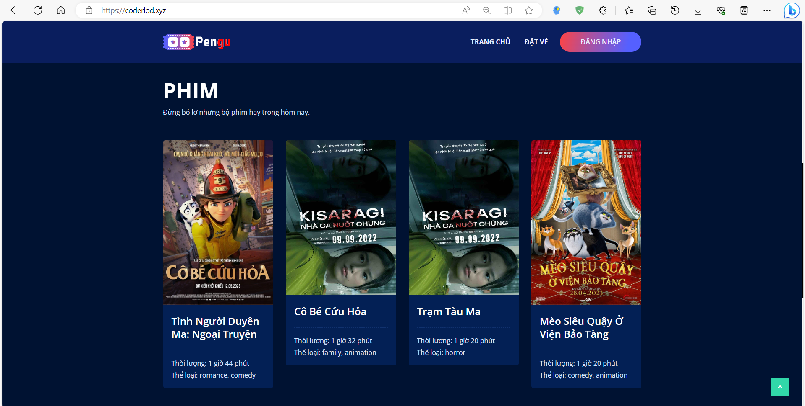
</div>

- **Danh mục phim:**
<div align='center'>
	
</div>

- **Chi tiết phim:**
<div align='center'>
	
</div>

- **Đăng nhập/đăng ký User:**
<div align='center'>
	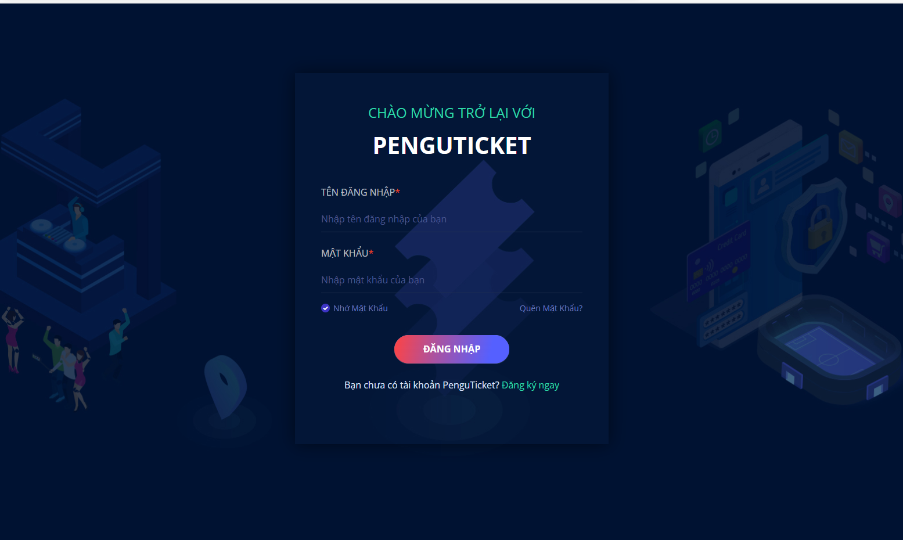
	<br>
	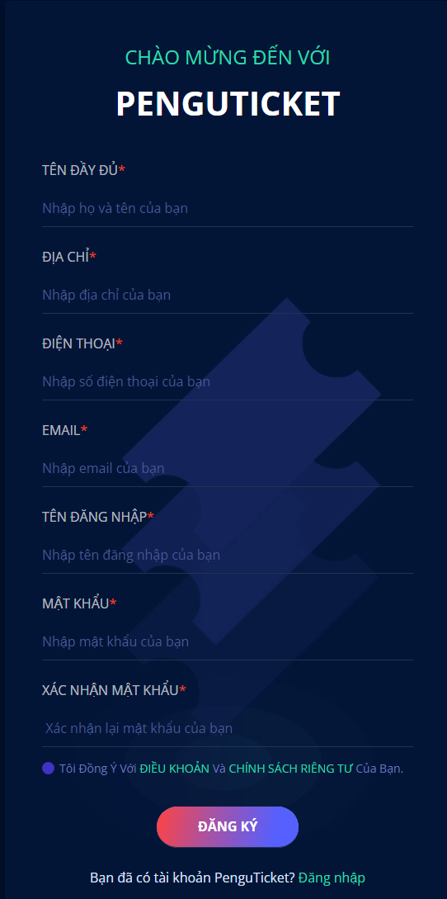
</div>

- **Đăng nhập Admin:**
<div align='center'>
	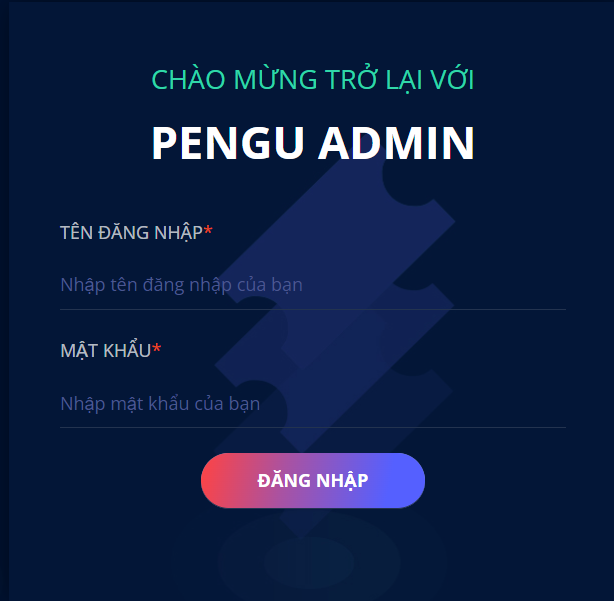
</div>

- **Admin quản lý tài khoản:**
<div align='center'>
	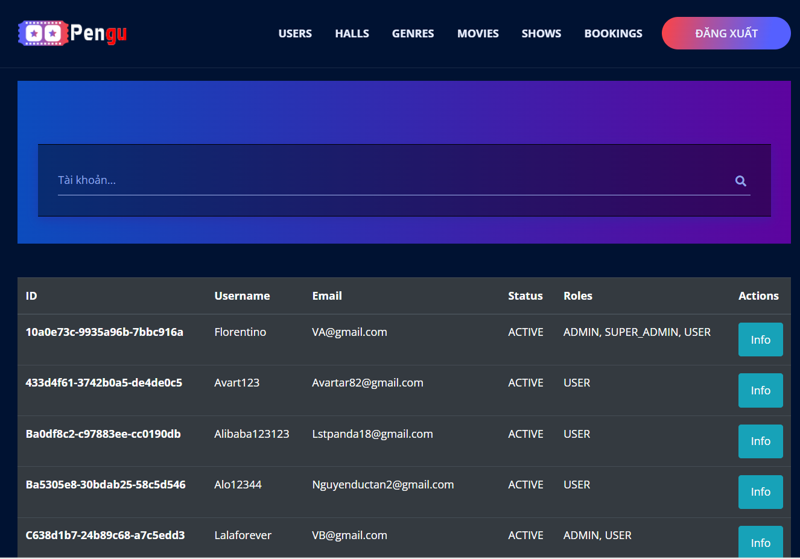
</div>

- **Admin thêm suất chiếu:**
<div align='center'>
	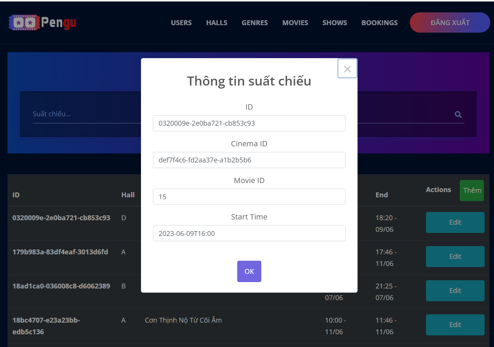
</div>

- **Chọn giờ xem:**
<div align='center'>
	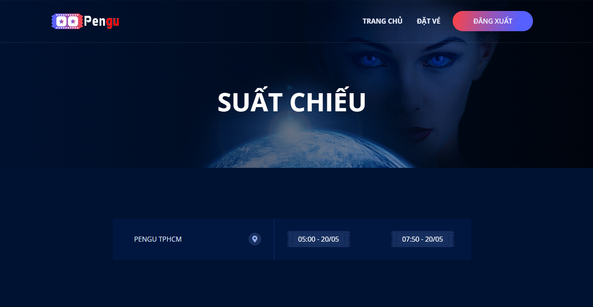
</div>

- **Chọn ghế:**
<div align='center'>
	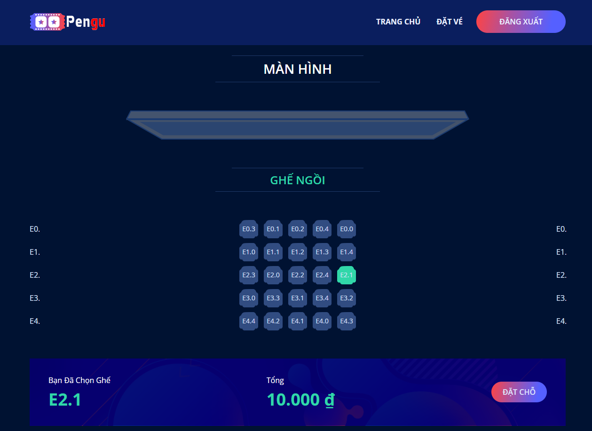
</div>

- **Thanh toán:**
<div align='center'>
	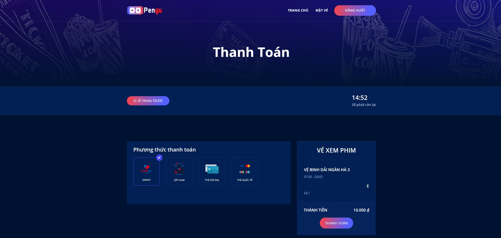
</div>

- **Swagger Api-doc:**
<div align='center'>
	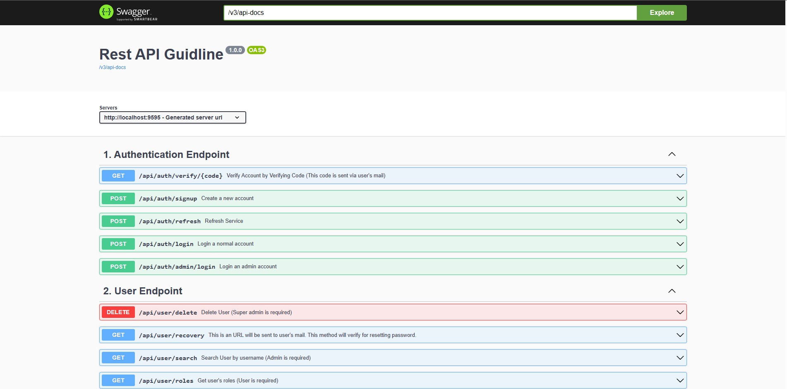
</div>

- **Sơ đồ mô hình hoạt động của web User:**
<div align='center'>
	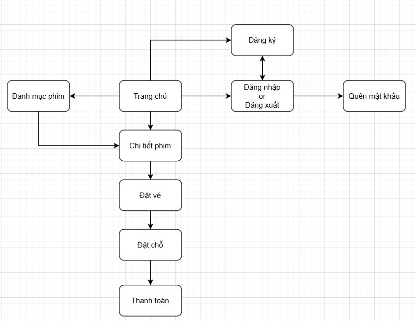
</div>

- **Sơ đồ mô hình hoạt động của web Admin:**
<div align='center'>
	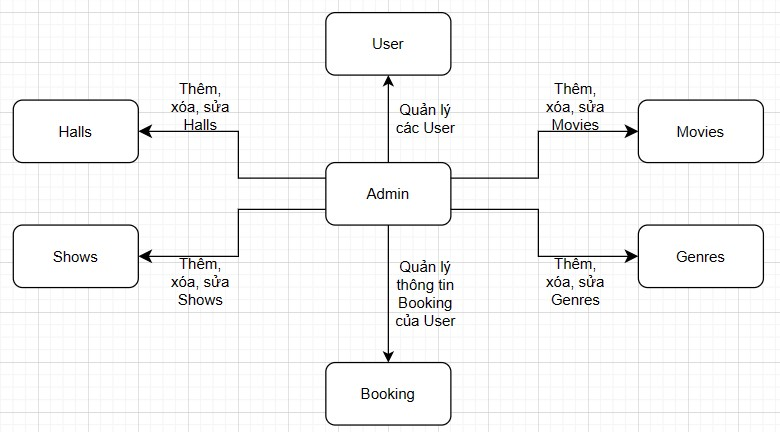
</div>

- **Mối quan hệ giữ các trang web:**
<div align='center'>
	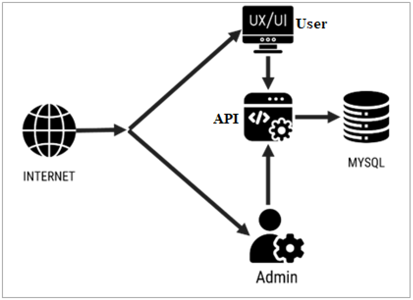
</div>

- **Sơ đồ database:**
<div align='center'>
	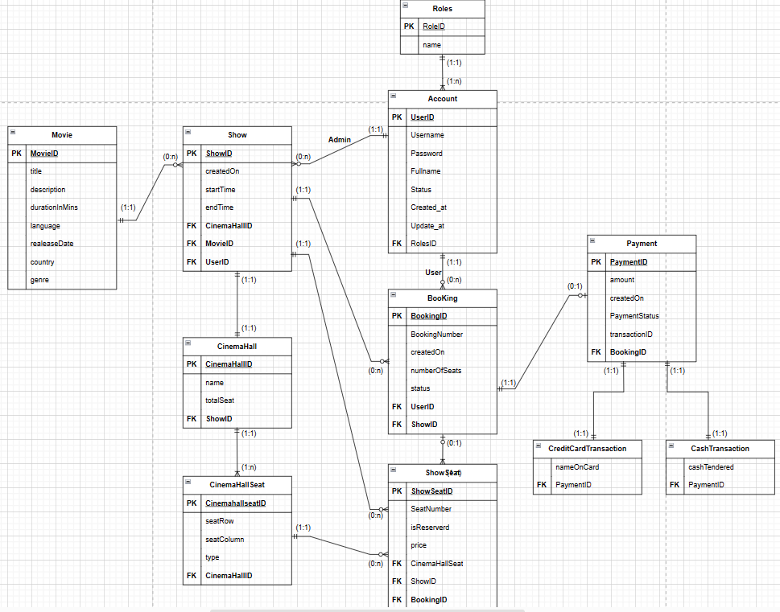
</div>

---
© Group Pengu - NT213.N21.ANTT, University of Information Technology - UIT
